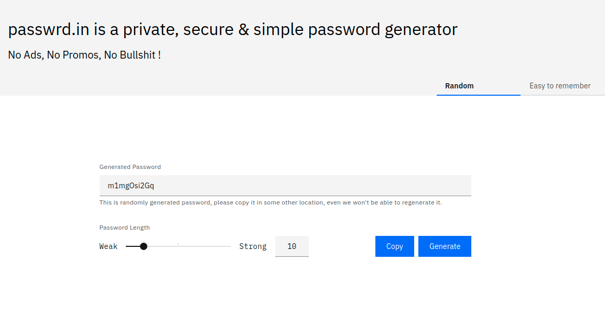

# [passwrd.in](passwrd.in)

Private, Secure & Simple password generator. It is just another password generator but with an objective to make password generation simple, secure, non-proprietary, without ads, without promotions, without upsell - just dead-simple.

So that sys-admin, developer, business owner, normal user, kids & everyone else who needs a password use a potentially secure password without a second thought.

And there is an effortless layer of security.




## Why ?

- A lot of existing website either advertise themselves or they make it a complex process.
- Few of them collect password for "analytics" purposes.
- Sometimes you need a strong password, sometimes you need easy to remember.
- There is password generation feature in chrome - sometimes it doesn't work.
- You are a sys admin, org admin or a developer and you need to give good password to business user - rather test, 1234 .... you know it !
- You just need a website which can give you a password without any bullshit.
- You want to self host fancy password generator. 


## Project setup

```
yarn install
```

### Compiles and hot-reloads for development

```
yarn serve
```

### Compiles and minifies for production

```
yarn build
```

### Lints and fixes files

```
yarn lint
```

## TODO:

- [ ] Munged Password
- [ ] Predictable Password (salt keyword with master password, hash it & give partial hash as password.)


